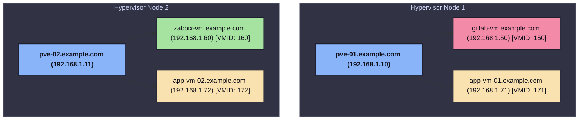

# Infrastructure Schema Configuration Analysis

A reconstruction of the infrastructure schema based on the Ansible repository inventory and variable configurations.

## Overview
Based on [hosts.yml](file:///home/cyberbat/work/demo.ansible_demo/hosts.yml) and variables in [group_vars](file:///home/cyberbat/work/demo.ansible_demo/group_vars/), the infrastructure consists of a Proxmox VE (PVE) virtualization environment hosting virtual machines.

- **Total Hypervisors**: 2 Proxmox nodes (`pve-01.example.com`, `pve-02.example.com`)
- **Total Guest VMs**: 4 Virtual Machines (1x GitLab, 1x Zabbix, 2x App Servers)
- **Networking Scheme**: Internal subnets sharing the gateway `192.168.1.1` and subnet prefix `/24`.

---

## 1. Vertical ASCII Tree Diagram

```text
                       [ Proxmox Infrastructure ]
                                    │
         ┌──────────────────────────┴──────────────────────────┐
         ▼                                                     ▼
┌──────────────────┐                                  ┌──────────────────┐
│pve-01.example.com│                                  │pve-02.example.com│
│   192.168.1.10   │                                  │   192.168.1.11   │
└────────┬─────────┘                                  └────────┬─────────┘
         │                                                     │
         ├──────────────────────────┐                          ├──────────────────────────┐
         ▼                          ▼                          ▼                          ▼
┌──────────────────┐       ┌──────────────────┐       ┌──────────────────┐       ┌──────────────────┐
│gitlab-vm.example.│       │app-vm-01.example.│       │zabbix-vm.example.│       │app-vm-02.example.│
│       com        │       │       com        │       │       com        │       │       com        │
│   192.168.1.50   │       │   192.168.1.71   │       │   192.168.1.60   │       │   192.168.1.72   │
└──────────────────┘       └──────────────────┘       └──────────────────┘       └──────────────────┘
```

---

## 2. Mermaid JS Diagram



---

## 3. Specification Tables

### Proxmox Hypervisors
| Hostname / FQDN | IP Address | Proxmox Node ID | Ansible Groups | Extracted Specs |
| :--- | :--- | :--- | :--- | :--- |
| `pve-01.example.com` | `192.168.1.10` | `pve-01` | `proxmox_hypervisors`, `proxmox` | *Not defined in inventory/vars* |
| `pve-02.example.com` | `192.168.1.11` | `pve-02` | `proxmox_hypervisors`, `proxmox` | *Not defined in inventory/vars* |

### Virtual Machines (Guests)
| Hostname / FQDN | IP Address | VMID | Parent Hypervisor | CPU Cores | RAM (MB) | Disk Size | Gateway & Netmask | Ansible Groups |
| :--- | :--- | :--- | :--- | :--- | :--- | :--- | :--- | :--- |
| `gitlab-vm.example.com` | `192.168.1.50` | `150` | `pve-01.example.com` | `2` | `4096` | `50G` | `192.168.1.1/24` | `gitlab_servers`, `vms`, `proxmox`, `monitored_nodes` |
| `zabbix-vm.example.com` | `192.168.1.60` | `160` | `pve-02.example.com` | `2` | `2048` | `20G` | `192.168.1.1/24` | `zabbix_servers`, `vms`, `proxmox`, `monitored_nodes` |
| `app-vm-01.example.com` | `192.168.1.71` | `171` | `pve-01.example.com` | `1` | `1024` | `10G` | `192.168.1.1/24` | `app_servers`, `vms`, `proxmox`, `monitored_nodes` |
| `app-vm-02.example.com` | `192.168.1.72` | `172` | `pve-02.example.com` | `1` | `1024` | `10G` | `192.168.1.1/24` | `app_servers`, `vms`, `proxmox`, `monitored_nodes` |

---

## 4. Group Structure & Variables Mapping
This section maps the variable definitions found in `group_vars/` to host groups:

- **Group `all`** (variables in [vars.yml](file:///home/cyberbat/work/demo.ansible_demo/group_vars/all/vars.yml)):
  - Global system settings:
    - User: `admin_deploy`
    - SSH Private Key: `~/.ssh/id_ed25519_deploy`
    - Timezone: `Europe/Sofia`
    - DNS Servers: `1.1.1.1`, `8.8.8.8`
    - Domain: `example.com`

- **Group `proxmox`** (variables in [proxmox.yml](file:///home/cyberbat/work/demo.ansible_demo/group_vars/proxmox.yml)):
  - API and connection settings:
    - API User: `ansible-token@pve`
    - API Token ID: `ansible-token-id`
    - API host: resolves via `hostvars[pve_hypervisor_host].ansible_host`
    - Default Provisioning Template: `ubuntu-22.04-cloudinit-template`
    - Default Storage: `local-lvm`
    - Default Network Bridge: `vmbr0`

- **Group `gitlab_servers`** (variables in [gitlab.yml](file:///home/cyberbat/work/demo.ansible_demo/group_vars/gitlab.yml)):
  - Configuration:
    - Edition: `gitlab-ce`
    - External URL: `http://gitlab.example.com`
    - Runner coordinator URL: `http://gitlab.example.com`

- **Group `zabbix_servers`** (variables in [zabbix.yml](file:///home/cyberbat/work/demo.ansible_demo/group_vars/zabbix.yml)):
  - Configuration:
    - Zabbix Version: `7.0`
    - DB Name / User: `zabbix`
    - API URL: `http://zabbix.example.com/api_jsonrpc.php`

- **Group `monitored_nodes`**:
  - Automatically receive Zabbix Agent installation. Agent connects back to server `zabbix_server_ip` (`192.168.1.60`) on port `10050`.
