# Infrastructure Schema

This document details the visual and logical infrastructure architecture described by this Ansible repository.

The infrastructure consists of a **Proxmox VE (PVE)** hypervisor hosting multiple Ubuntu-based virtual machines, provisioned dynamically and configured with a self-hosted **GitLab** version control server and a centralized **Zabbix** monitoring cluster.

---

## 📊 Infrastructure Architecture Diagram

The diagram below represents the logical layout, resource allocations, and network communication flows.

```mermaid
graph TD
    subgraph Control ["Control & Orchestration Plane"]
        A["Ansible Control Node<br/>(Localhost)"]
        Bitwarden["Bitwarden Secrets Manager<br/>(via bws API)"]
        A -.->|Fetch Secrets| Bitwarden
    end

    subgraph PVE ["Physical Hypervisor Layer"]
        PVE_Host["Proxmox VE Host: pve-01.example.com<br/>(IP: 192.168.1.10)"]
        
        subgraph VMs ["Virtual Machine Infrastructure (vmbr0 bridge)"]
            style VMs fill:#f8fafc,stroke:#cbd5e1,stroke-width:2px
            
            subgraph VM_GitLab ["GitLab VM (VMID 150)"]
                GL_Host["gitlab-vm.example.com<br/>(IP: 192.168.1.50)"]
                GL_App["GitLab CE<br/>(HTTP: 80)"]
                GL_Runner["GitLab Runner<br/>(Shell Executor)"]
            end
            
            subgraph VM_Zabbix ["Zabbix VM (VMID 160)"]
                ZB_Host["zabbix-vm.example.com<br/>(IP: 192.168.1.60)"]
                ZB_Server["Zabbix Server 7.0<br/>(Port: 10051)"]
                ZB_Web["Apache Frontend & API<br/>(HTTP: 80)"]
                ZB_DB["MariaDB Database<br/>(Port: 3306)"]
            end
            
            subgraph VM_App01 ["App VM 01 (VMID 171)"]
                App1_Host["app-vm-01.example.com<br/>(IP: 192.168.1.71)"]
                App1_Agent["Zabbix Agent<br/>(Port: 10050)"]
            end

            subgraph VM_App02 ["App VM 02 (VMID 172)"]
                App2_Host["app-vm-02.example.com<br/>(IP: 192.168.1.72)"]
                App2_Agent["Zabbix Agent<br/>(Port: 10050)"]
            end
        end
    end

    %% Provisioning Connections
    A == "1. Proxmox API (HTTPS 8006)" ==> PVE_Host
    A -. "2. SSH VM Wait (SSH 22)" .-> GL_Host
    A -. "2. SSH VM Wait (SSH 22)" .-> ZB_Host
    A -. "2. SSH VM Wait (SSH 22)" .-> App1_Host
    A -. "2. SSH VM Wait (SSH 22)" .-> App2_Host

    %% Software Deployment
    A == "3. Deploy GitLab & Runner" ==> GL_Host
    A == "4. Deploy Zabbix & MariaDB" ==> ZB_Host
    A == "5. Deploy Agents & Register" ==> App1_Host
    A == "5. Deploy Agents & Register" ==> App2_Host

    %% Internal Communication & Monitoring Flows
    GL_Runner -- "Register & Poll (HTTP 80)" --> GL_App
    
    ZB_Server -- "Monitor (TCP 10050)" --> App1_Agent
    ZB_Server -- "Monitor (TCP 10050)" --> App2_Agent
    ZB_Server -- "Monitor (TCP 10050)" --> GL_Runner
    ZB_Server -- "Monitor (TCP 10050)" --> ZB_Host
    
    ZB_Server --- ZB_DB
    ZB_Web --- ZB_Server

    %% Automated Registration API Calls (from Ansible control node on behalf of hosts)
    A -. "Register Hosts via API (HTTP 80)" .-> ZB_Web

    %% Styling
    classDef control fill:#e0f2fe,stroke:#0284c7,stroke-width:2px,color:#0369a1;
    classDef hypervisor fill:#fee2e2,stroke:#dc2626,stroke-width:2px,color:#991b1b;
    classDef gitlab fill:#f3e8ff,stroke:#7e22ce,stroke-width:2px,color:#6b21a8;
    classDef zabbix fill:#fef9c3,stroke:#ca8a04,stroke-width:2px,color:#854d0e;
    classDef app fill:#dcfce7,stroke:#16a34a,stroke-width:2px,color:#166534;
    
    class A,Bitwarden control;
    class PVE_Host hypervisor;
    class GL_Host,GL_App,GL_Runner gitlab;
    class ZB_Host,ZB_Server,ZB_Web,ZB_DB zabbix;
    class App1_Host,App1_Agent,App2_Host,App2_Agent app;
```

---

## 🖥️ Server and Virtual Machine Resource Allocation

The following virtual machines are provisioned automatically on the Proxmox Hypervisor (`pve-01.example.com`, IP: `192.168.1.10`) under the `vmbr0` virtual bridge:

| Hostname | IP Address | VMID | CPU Cores | RAM (MB) | Disk Size | Roles / Software Installed |
| :--- | :--- | :--- | :--- | :--- | :--- | :--- |
| **gitlab-vm.example.com** | `192.168.1.50` | `150` | 2 | 4096 | 50 GB | GitLab CE, GitLab Runner (Shell Executor), Zabbix Agent |
| **zabbix-vm.example.com** | `192.168.1.60` | `160` | 2 | 2048 | 20 GB | Zabbix Server 7.0, Apache Frontend, MariaDB Database, Zabbix Agent |
| **app-vm-01.example.com** | `192.168.1.71` | `171` | 1 | 1024 | 10 GB | Application node (Target deployment), Zabbix Agent |
| **app-vm-02.example.com** | `192.168.1.72` | `172` | 1 | 1024 | 10 GB | Application node (Target deployment), Zabbix Agent |

---

## 🔌 Port Allocation & Communication Matrix

The table below describes all network communication flows between components:

| Source | Destination | Port / Protocol | Service Name | Purpose |
| :--- | :--- | :--- | :--- | :--- |
| **Ansible Controller** | **Proxmox Hypervisor** | `8006 / TCP (HTTPS)` | Proxmox VE API | VM provisioning (cloning, hardware sizing, network boot configuration) |
| **Ansible Controller** | **All VMs** | `22 / TCP (SSH)` | OpenSSH | System bootstrapping, software package installations, and configuration management |
| **Ansible Controller** | **Zabbix Server** | `80 / TCP (HTTP)` | Apache / Zabbix Web | Automated registration of VMs using Ansible's `zabbix_host` via Zabbix JSON-RPC API |
| **Zabbix Server** | **All VMs** | `10050 / TCP` | Zabbix Agent | Querying system performance metrics (CPU, Memory, Disk, Network) |
| **Zabbix Server** | **Zabbix VM (Local)** | `3306 / TCP` | MariaDB | Storing metrics history, user credentials, and server configurations |
| **GitLab Runner** | **GitLab Server** | `80 / TCP (HTTP)` | GitLab API | Runner registration and polling for available CI/CD jobs |

---

## 🛠️ Infrastructure Provisioning & Configuration Lifecycles

The Ansible automation enforces a 5-step sequential orchestration lifecycle:

1. **Hypervisor Orchestration (`proxmox_vm` role)**:
   - Ansible connects to the Proxmox API (`8006`) to clone new VMs from a pre-configured Ubuntu cloud-init template (`ubuntu-22.04-cloudinit-template`).
   - Network properties (static IP, gateway) and hardware sizes (cores, RAM, disk) are injected via cloud-init.
   - Virtual machines are powered on.

2. **Connectivity Handshake (`site.yml` tasks)**:
   - Ansible waits for Port `22` (SSH) to respond on all target VMs with a timeout of 300 seconds.

3. **CI/CD Platform Bootstrap (`gitlab_server` role)**:
   - Installs GitLab dependencies, registers the official GitLab Omnibus repository, and installs the `gitlab-ce` package.
   - Configures `gitlab.rb` parameters (external URL, etc.) and performs a `gitlab-ctl reconfigure`.
   - Installs the GitLab Runner and registers it with the local GitLab instance using a secure registration token from the Vault.

4. **Monitoring Hub Setup (`zabbix_server` role)**:
   - Installs and starts `mariadb-server`.
   - Creates the `zabbix` database and user, then imports the initial SQL database schema (`server.sql.gz`).
   - Adds the Zabbix official repository, installs the server packages, configs `zabbix_server.conf`, and starts the services (`zabbix-server` & `apache2`).

5. **Agent Enrollment & API Registration (`zabbix_agent` role)**:
   - Installs `zabbix-agent` on all VMs (including GitLab and Zabbix hosts themselves).
   - Dynamically registers all nodes into the Zabbix Server backend using the Zabbix API (`zabbix_host` module executing on the localhost controller).
