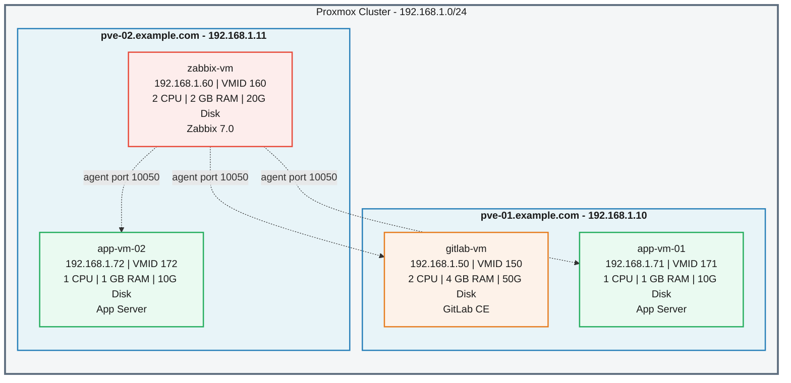

# Infrastructure Schema

> **Auto-generated from Ansible source files**
> Source inventory: `hosts.yml` · Group variables: `group_vars/` · Role defaults: `roles/proxmox_vm/defaults/`
> Generated: 2026-06-14

---

## 1. Vertical ASCII Tree

```
                        ┌──────────────────────────────────┐
                        │       PROXMOX CLUSTER            │
                        │     (proxmox_hypervisors)        │
                        └───────────────┬──────────────────┘
                 ┌──────────────────────┴──────────────────────┐
                 │                                             │
    ┌────────────┴────────────────┐           ┌────────────────┴────────────────┐
    │   pve-01.example.com       │           │   pve-02.example.com           │
    │   IP: 192.168.1.10         │           │   IP: 192.168.1.11             │
    │   Role: Hypervisor         │           │   Role: Hypervisor             │
    └────────────┬───────────────┘           └────────────────┬────────────────┘
                 │                                            │
        ┌────────┴────────┐                          ┌───────┴────────┐
        │                 │                          │                │
  ┌─────┴──────────┐ ┌───┴────────────┐   ┌────────┴──────────┐ ┌──┴───────────────┐
  │ gitlab-vm      │ │ app-vm-01      │   │ zabbix-vm        │ │ app-vm-02        │
  │ .example.com   │ │ .example.com   │   │ .example.com     │ │ .example.com     │
  │ 192.168.1.50   │ │ 192.168.1.71   │   │ 192.168.1.60     │ │ 192.168.1.72     │
  │ VMID: 150      │ │ VMID: 171      │   │ VMID: 160        │ │ VMID: 172        │
  │ 2 CPU / 4 GB   │ │ 1 CPU / 1 GB   │   │ 2 CPU / 2 GB     │ │ 1 CPU / 1 GB     │
  │ Disk: 50G      │ │ Disk: 10G      │   │ Disk: 20G        │ │ Disk: 10G        │
  │ [GitLab CE]    │ │ [App Server]   │   │ [Zabbix 7.0]     │ │ [App Server]     │
  └────────────────┘ └────────────────┘   └──────────────────┘ └──────────────────┘
```

---

## 2. Mermaid Diagram



---

## 3. Specification Tables

### 3.1 Hypervisors (Proxmox Nodes)

| Hostname | IP Address | Ansible Group | Default Storage | Default Bridge | Cloud-Init Template | VMs Hosted |
|---|---|---|---|---|---|---|
| `pve-01.example.com` | `192.168.1.10` | `proxmox_hypervisors` | `local-lvm` | `vmbr0` | `ubuntu-22.04-cloudinit-template` | `gitlab-vm`, `app-vm-01` |
| `pve-02.example.com` | `192.168.1.11` | `proxmox_hypervisors` | `local-lvm` | `vmbr0` | `ubuntu-22.04-cloudinit-template` | `zabbix-vm`, `app-vm-02` |

### 3.2 Virtual Machines

| Hostname | IP Address | VMID | Hypervisor | CPU Cores | RAM (MB) | Disk | Gateway | Prefix | Ansible Groups | Service |
|---|---|---|---|---|---|---|---|---|---|---|
| `gitlab-vm.example.com` | `192.168.1.50` | 150 | `pve-01.example.com` | 2 | 4096 | 50G | 192.168.1.1 | /24 | `gitlab_servers`, `vms`, `monitored_nodes` | GitLab CE |
| `zabbix-vm.example.com` | `192.168.1.60` | 160 | `pve-02.example.com` | 2 | 2048 | 20G | 192.168.1.1 | /24 | `zabbix_servers`, `vms`, `monitored_nodes` | Zabbix Server 7.0 |
| `app-vm-01.example.com` | `192.168.1.71` | 171 | `pve-01.example.com` | 1 | 1024 | 10G | 192.168.1.1 | /24 | `app_servers`, `vms`, `monitored_nodes` | Application Server |
| `app-vm-02.example.com` | `192.168.1.72` | 172 | `pve-02.example.com` | 1 | 1024 | 10G | 192.168.1.1 | /24 | `app_servers`, `vms`, `monitored_nodes` | Application Server |

### 3.3 Aggregate Resource Summary

| Resource | pve-01 Total | pve-02 Total | Cluster Total |
|---|---|---|---|
| Virtual Machines | 2 | 2 | 4 |
| Allocated CPU Cores | 3 | 3 | 6 |
| Allocated RAM | 5120 MB (5 GB) | 3072 MB (3 GB) | 8192 MB (8 GB) |
| Allocated Disk | 60 GB | 30 GB | 90 GB |

---

## 4. Ansible Group Hierarchy

```
all
└── proxmox
    ├── proxmox_hypervisors
    │   ├── pve-01.example.com
    │   └── pve-02.example.com
    └── vms
        ├── gitlab_servers
        │   └── gitlab-vm.example.com
        ├── zabbix_servers
        │   └── zabbix-vm.example.com
        └── app_servers
            ├── app-vm-01.example.com
            └── app-vm-02.example.com

monitored_nodes  (cross-cutting group)
├── gitlab_servers   → gitlab-vm.example.com
├── zabbix_servers   → zabbix-vm.example.com
└── app_servers      → app-vm-01.example.com, app-vm-02.example.com
```

---

## 5. Network Topology

| Segment | Subnet | Gateway | Hosts |
|---|---|---|---|
| Hypervisor Management | `192.168.1.10 - .11` | — | `pve-01`, `pve-02` |
| GitLab Service | `192.168.1.50` | `192.168.1.1` | `gitlab-vm` |
| Zabbix Service | `192.168.1.60` | `192.168.1.1` | `zabbix-vm` |
| App Tier | `192.168.1.71 - .72` | `192.168.1.1` | `app-vm-01`, `app-vm-02` |

- **Bridge**: All VMs connect via `vmbr0`
- **DNS**: `1.1.1.1`, `8.8.8.8` (from `group_vars/all/vars.yml`)
- **Timezone**: `Europe/Sofia`
- **Domain**: `example.com`

---

## 6. Deployment Workflow (from `site.yml`)

| Phase | Play | Target Hosts | Role / Task | Key Tags |
|---|---|---|---|---|
| 1 | Provision VMs | `vms` | `proxmox_vm` | `vm_clone`, `vm_config`, `vm_network`, `vm_start`, `provision` |
| 2 | Wait for SSH | `vms` | `wait_for_connection` | `wait_ssh` |
| 3 | Deploy GitLab | `gitlab_servers` | `gitlab_server` | — |
| 4 | Deploy Zabbix Server | `zabbix_servers` | `zabbix_server` | — |
| 5 | Configure Monitoring | `monitored_nodes` | `zabbix_agent` | — |

---

## 7. Service Integration Map

```
┌─────────────────────────────────────────────────────────┐
│                    Monitoring Plane                       │
│                                                          │
│   zabbix-vm (192.168.1.60)  ◄─── Zabbix Server 7.0      │
│       │                          API: /api_jsonrpc.php   │
│       │  Agent connections (port 10050)                   │
│       ├──── gitlab-vm   (192.168.1.50) ── Zabbix Agent   │
│       ├──── app-vm-01   (192.168.1.71) ── Zabbix Agent   │
│       └──── app-vm-02   (192.168.1.72) ── Zabbix Agent   │
│                                                          │
├──────────────────────────────────────────────────────────┤
│                    Application Plane                      │
│                                                          │
│   gitlab-vm (192.168.1.50)  ◄─── GitLab CE               │
│       URL: http://gitlab.example.com                     │
│       Edition: gitlab-ce                                 │
│                                                          │
│   app-vm-01 (192.168.1.71)  ◄─── Application Server     │
│   app-vm-02 (192.168.1.72)  ◄─── Application Server     │
│                                                          │
├──────────────────────────────────────────────────────────┤
│                  Infrastructure Plane                     │
│                                                          │
│   pve-01 (192.168.1.10) ◄─── Proxmox VE Hypervisor      │
│   pve-02 (192.168.1.11) ◄─── Proxmox VE Hypervisor      │
│       API User: ansible-token@pve                        │
│       Storage: local-lvm   Bridge: vmbr0                 │
│       Template: ubuntu-22.04-cloudinit-template          │
│                                                          │
└──────────────────────────────────────────────────────────┘
```

---

## 8. Data Sources

This document was generated exclusively from the following Ansible source files:

| File | Purpose |
|---|---|
| `hosts.yml` | Inventory: hosts, groups, per-host variables (VMID, CPU, RAM, disk, networking) |
| `group_vars/proxmox.yml` | Proxmox API credentials, default VM provisioning settings |
| `group_vars/gitlab.yml` | GitLab edition, URL, runner configuration |
| `group_vars/zabbix.yml` | Zabbix version, DB config, API endpoint, agent settings |
| `group_vars/all/vars.yml` | Global settings: SSH user, DNS, timezone, domain |
| `roles/proxmox_vm/defaults/main.yml` | Default VM sizing: 1 CPU, 1024 MB RAM, 10G disk |
| `roles/proxmox_vm/tasks/main.yml` | VM provisioning workflow with `delegate_to` hypervisor mapping |
| `site.yml` | 5-phase deployment playbook orchestration |
