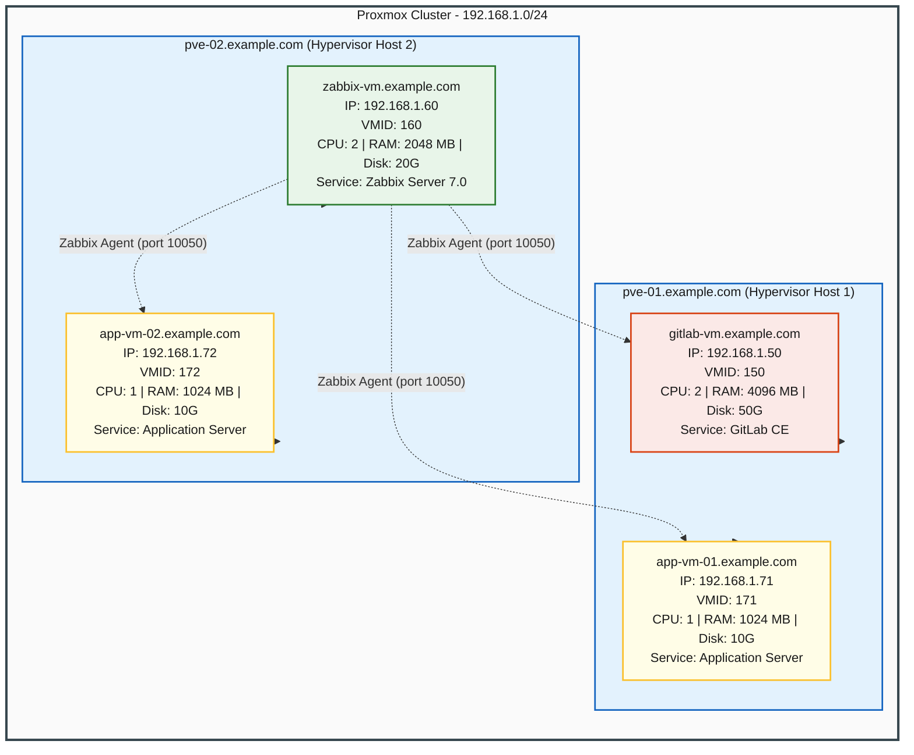

# Infrastructure Schema Documentation (Reconstructed)

This document contains a comprehensive reconstruction of the infrastructure schema and deployment orchestration. It is derived exclusively from the raw Ansible inventory, variables, and playbooks in the repository.

---

## 1. Vertical ASCII Tree

Below is the top-down vertical tree diagram representing the Proxmox cluster hierarchy. Hypervisors are positioned at the root level, with virtual machines branching off below. VM nodes contain their hostname, IP address, VMID, allocated CPU cores, RAM, and disk size.

```text
                                [ PROXMOX VE CLUSTER ]
                                          │
                  ┌───────────────────────┴───────────────────────┐
                  ▼                                               ▼
     ┌─────────────────────────┐                     ┌─────────────────────────┐
     │   pve-01.example.com    │                     │   pve-02.example.com    │
     │    IP: 192.168.1.10     │                     │    IP: 192.168.1.11     │
     └────────────┬────────────┘                     └────────────┬────────────┘
                  │                                               │
          ┌───────┴───────┐                               ┌───────┴───────┐
          ▼               ▼                               ▼               ▼
   ┌─────────────┐ ┌─────────────┐                 ┌─────────────┐ ┌─────────────┐
   │  gitlab-vm  │ │  app-vm-01  │                 │  zabbix-vm  │ │  app-vm-02  │
   │ .example.com│ │ .example.com│                 │ .example.com│ │ .example.com│
   │192.168.1.50 │ │192.168.1.71 │                 │192.168.1.60 │ │192.168.1.72 │
   │  VMID: 150  │ │  VMID: 171  │                 │  VMID: 160  │ │  VMID: 172  │
   │ CPU: 2 Cores│ │ CPU: 1 Core │                 │ CPU: 2 Cores│ │ CPU: 1 Core │
   │ RAM: 4096 MB│ │ RAM: 1024 MB│                 │ RAM: 2048 MB│ │ RAM: 1024 MB│
   │  Disk: 50G  │ │  Disk: 10G  │                 │  Disk: 20G  │ │  Disk: 10G  │
   └─────────────┘ └─────────────┘                 └─────────────┘ └─────────────┘
```

---

## 2. Mermaid JS Diagram

This flowchart outlines the vertical VM hierarchy along with dotted monitoring lines representing Zabbix Agent connections back to the Zabbix Server. Pastel colors are utilized with dark text (`#1a1a1a`) to ensure maximum legibility.



---

## 3. Specification Tables

### 3.1 Proxmox Hypervisors
| Hostname | IP Address | Ansible Group | Default Storage | Default Bridge | Cloud-Init Template | VMs Hosted |
| :--- | :--- | :--- | :--- | :--- | :--- | :--- |
| `pve-01.example.com` | `192.168.1.10` | `proxmox_hypervisors`, `proxmox` | `local-lvm` | `vmbr0` | `ubuntu-22.04-cloudinit-template` | `gitlab-vm.example.com`<br>`app-vm-01.example.com` |
| `pve-02.example.com` | `192.168.1.11` | `proxmox_hypervisors`, `proxmox` | `local-lvm` | `vmbr0` | `ubuntu-22.04-cloudinit-template` | `zabbix-vm.example.com`<br>`app-vm-02.example.com` |

### 3.2 Virtual Machines
| Hostname | IP Address | VMID | Hypervisor | CPU Cores | RAM (MB) | Disk Size | Gateway | Prefix | Ansible Groups | Service |
| :--- | :--- | :--- | :--- | :--- | :--- | :--- | :--- | :--- | :--- | :--- |
| `gitlab-vm.example.com` | `192.168.1.50` | `150` | `pve-01.example.com` | `2` | `4096` | `50G` | `192.168.1.1` | `24` | `gitlab_servers`, `vms`, `proxmox`, `monitored_nodes` | GitLab CE Server & Runner |
| `zabbix-vm.example.com` | `192.168.1.60` | `160` | `pve-02.example.com` | `2` | `2048` | `20G` | `192.168.1.1` | `24` | `zabbix_servers`, `vms`, `proxmox`, `monitored_nodes` | Zabbix Server 7.0 & Agent |
| `app-vm-01.example.com` | `192.168.1.71` | `171` | `pve-01.example.com` | `1` | `1024` | `10G` | `192.168.1.1` | `24` | `app_servers`, `vms`, `proxmox`, `monitored_nodes` | Application Server & Zabbix Agent |
| `app-vm-02.example.com` | `192.168.1.72` | `172` | `pve-02.example.com` | `1` | `1024` | `10G` | `192.168.1.1` | `24` | `app_servers`, `vms`, `proxmox`, `monitored_nodes` | Application Server & Zabbix Agent |

### 3.3 Aggregate Resource Summary
| Resource | pve-01 Total | pve-02 Total | Cluster Total |
| :--- | :--- | :--- | :--- |
| **Virtual Machines (VMs)** | 2 | 2 | 4 |
| **Allocated CPU Cores** | 3 Cores | 3 Cores | 6 Cores |
| **Allocated RAM (MB)** | 5,120 MB (5 GB) | 3,072 MB (3 GB) | 8,192 MB (8 GB) |
| **Allocated Disk (GB)** | 60 GB | 30 GB | 90 GB |

---

## 4. Ansible Group Hierarchy

The complete organizational nesting pattern extracted from the inventory structure:

```text
all
├── proxmox
│   ├── proxmox_hypervisors
│   │   ├── pve-01.example.com
│   │   └── pve-02.example.com
│   └── vms
│       ├── gitlab_servers
│       │   └── gitlab-vm.example.com
│       ├── zabbix_servers
│       │   └── zabbix-vm.example.com
│       └── app_servers
│           ├── app-vm-01.example.com
│           └── app-vm-02.example.com
│
└── monitored_nodes
    ├── gitlab_servers (indirectly references gitlab-vm.example.com)
    ├── zabbix_servers (indirectly references zabbix-vm.example.com)
    └── app_servers (indirectly references app-vm-01.example.com, app-vm-02.example.com)
```

---

## 5. Network Topology Table

| Parameter | Value / Range | Description |
| :--- | :--- | :--- |
| **IP Subnet Range** | `192.168.1.0/24` | Shared IP subnet for all VMs and Hypervisors |
| **Gateway** | `192.168.1.1` | Gateway for all VMs |
| **Network Bridge** | `vmbr0` | Default Proxmox network bridge used by VMs |
| **DNS Servers** | `1.1.1.1`, `8.8.8.8` | Configured globally in `group_vars/all/vars.yml` |
| **Timezone** | `Europe/Sofia` | Configured globally in `group_vars/all/vars.yml` |
| **Domain** | `example.com` | Configured globally in `group_vars/all/vars.yml` |
| **Hypervisor Management IPs** | `192.168.1.10`, `192.168.1.11` | IP addresses of Proxmox nodes |
| **VM IP Allocation** | `192.168.1.50` (GitLab)<br>`192.168.1.60` (Zabbix)<br>`192.168.1.71` (App 01)<br>`192.168.1.72` (App 02) | Static IPs configured via cloud-init config |

---

## 6. Deployment Workflow Table

This sequence outlines the stages parsed from `site.yml` during a complete deployment run:

| Phase | Play / Target | Roles / Tasks | Tags | Description |
| :--- | :--- | :--- | :--- | :--- |
| **Phase 1** | **Provision Infrastructure VMs on ProxMox Hypervisors**<br>Target: `vms` | Role: `proxmox_vm` | `vm_clone`, `vm_config`, `vm_network`, `vm_start`, `provision` | Clones VMs from template, configures CPU/RAM hardware specs, applies cloud-init IPs, and starts the VMs on PVE nodes. |
| **Phase 2** | **Wait for SSH Connectivity on New VMs**<br>Target: `vms` | Task: Wait for SSH port to be open | `wait_ssh` | Pauses execution until the newly booted VMs are reachable over SSH (300s timeout). |
| **Phase 3** | **Deploy GitLab Server**<br>Target: `gitlab_servers` | Role: `gitlab_server` | `install_prereqs`, `add_repo`, `install_app`, `configure_settings`, `apply_config`, `setup_runner`, `bootstrap`, `config`, `runner` | Installs system dependencies, configures apt repository, installs GitLab CE package, configures `/etc/gitlab/gitlab.rb`, reconfigures GitLab, and registers a shared GitLab Runner. |
| **Phase 4** | **Deploy Zabbix Monitoring Server**<br>Target: `zabbix_servers` | Role: `zabbix_server` | `install_db`, `start_services`, `configure_db`, `add_repo`, `install_app`, `check_db`, `import_schema`, `configure_settings`, `bootstrap`, `config` | Sets up MariaDB, database and users, configures Zabbix repository and packages, checks and imports initial DB schema, configures Zabbix Server, and starts service. |
| **Phase 5** | **Configure Zabbix Agents and Register Monitored Nodes**<br>Target: `monitored_nodes` | Role: `zabbix_agent` | `add_repo`, `install_agent`, `configure_agent`, `start_agent`, `register_monitoring`, `bootstrap`, `config` | Deploys Zabbix repository and agent on all monitored hosts, creates agent configurations pointing to Zabbix Server (`192.168.1.60`), and automatically registers them via Zabbix API. |

---

## 7. Service Integration Map

Below is a schematic visual layout mapping interactions between the Monitoring Plane, the Application Plane, and the Proxmox Hypervisor Infrastructure:

```text
┌─────────────────────────────────────────────────────────────────────────────────┐
│                                                                                 │
│                                MONITORING PLANE                                 │
│                                                                                 │
│                       ┌───────────────────────────────┐                         │
│                       │    zabbix-vm.example.com      │                         │
│                       │        192.168.1.60           │                         │
│                       │   (Zabbix Server Web UI)      │                         │
│                       └───────────────┬───────────────┘                         │
│                                       │                                         │
│                      Agent Poll / Push (TCP/10050)                              │
│         ┌─────────────────────────────┼─────────────────────────────┐           │
│         ▼                             ▼                             ▼           │
│ ┌───────────────┐             ┌───────────────┐             ┌───────────────┐   │
│ │   gitlab-vm   │             │   app-vm-01   │             │   app-vm-02   │   │
│ │ 192.168.1.50  │             │ 192.168.1.71  │             │ 192.168.1.72  │   │
│ │ Zabbix Agent  │             │ Zabbix Agent  │             │ Zabbix Agent  │   │
│ └───────────────┘             └───────────────┘             └───────────────┘   │
│                                                                                 │
├─────────────────────────────────────────────────────────────────────────────────┤
│                                                                                 │
│                               APPLICATION PLANE                                 │
│                                                                                 │
│   ┌────────────────────────────────┐       ┌────────────────────────────────┐   │
│   │     gitlab-vm.example.com      │       │      app-vm-01/02.example.com  │   │
│   │  - URL: http://gitlab.example  │       │  - Port: HTTP/HTTPS (varies)   │   │
│   │  - Runs: GitLab CE Core        │       │  - Deploy Target: App Services │   │
│   │  - Runner: Shell Executor      │       │                                │   │
│   └────────────────────────────────┘       └────────────────────────────────┘   │
│                                                                                 │
├─────────────────────────────────────────────────────────────────────────────────┤
│                                                                                 │
│                              INFRASTRUCTURE PLANE                               │
│                                                                                 │
│            ┌───────────────────────────────────────────────────────┐            │
│            │                 Proxmox VE Cluster                    │            │
│            │           Management Port: HTTPS/8006                 │            │
│            └───────────┬───────────────────────────────┬───────────┘            │
│                        │                               │                        │
│                        ▼                               ▼                        │
│            ┌───────────────────────┐       ┌───────────────────────┐            │
│            │  pve-01.example.com   │       │  pve-02.example.com   │            │
│            │     192.168.1.10      │       │     192.168.1.11      │            │
│            │  - gitlab-vm (150)    │       │  - zabbix-vm (160)    │            │
│            │  - app-vm-01 (171)    │       │  - app-vm-02 (172)    │            │
│            └───────────────────────┘       └───────────────────────┘            │
│                                                                                 │
└─────────────────────────────────────────────────────────────────────────────────┘
```

---

## 8. Data Sources Table

The infrastructure details documented above were extracted from the following files in the repository:

| File Path | File Type | Purpose / Description |
| :--- | :--- | :--- |
| [hosts.yml](hosts.yml) | YAML Inventory | Defines the Ansible host groups (`proxmox_hypervisors`, `gitlab_servers`, `zabbix_servers`, `app_servers`, `monitored_nodes`), mapping guest VMs to their Proxmox host hypervisors. Contains metadata specifications such as VMID, CPU cores, RAM size, disk size, and static IP parameters. |
| [group_vars/all/vars.yml](group_vars/all/vars.yml) | YAML Variables | Stores global environment configurations including the deployment user (`admin_deploy`), timezone (`Europe/Sofia`), DNS servers (`1.1.1.1`, `8.8.8.8`), and domain name (`example.com`). |
| [group_vars/proxmox.yml](group_vars/proxmox.yml) | YAML Variables | Defines Proxmox API settings and credentials, and sets default provisioning values for VMs (default storage, network bridge, and OS cloud-init template). |
| [group_vars/gitlab.yml](group_vars/gitlab.yml) | YAML Variables | Contains GitLab deployment details such as edition, external URLs, and runner registration parameters. |
| [group_vars/zabbix.yml](group_vars/zabbix.yml) | YAML Variables | Contains configuration details for Zabbix server and agent, including the server IP address (`192.168.1.60`), agent listen port (`10050`), version, and DB backend connection details. |
| [roles/proxmox_vm/defaults/main.yml](roles/proxmox_vm/defaults/main.yml) | YAML Variables | Declares default hardware sizing thresholds (1 CPU core, 1024 MB RAM, 10G disk size) and default PVE configuration settings. |
| [roles/proxmox_vm/tasks/main.yml](roles/proxmox_vm/tasks/main.yml) | YAML Tasks | Defines Proxmox virtualization VM lifecycle tasks (cloning, configuring resources, cloud-init setup, and power management) with `delegate_to` pointing to the respective PVE hypervisor. |
| [roles/gitlab_server/tasks/main.yml](roles/gitlab_server/tasks/main.yml) | YAML Tasks | Outlines steps to install GitLab dependencies, add repo, install package, configure via template, reconfigure system, and register runners. |
| [roles/zabbix_server/tasks/main.yml](roles/zabbix_server/tasks/main.yml) | YAML Tasks | Sets up MariaDB backend, creates databases and users, imports schemas, configures daemon templates, and restarts the Zabbix services. |
| [roles/zabbix_agent/tasks/main.yml](roles/zabbix_agent/tasks/main.yml) | YAML Tasks | Outlines steps to install Zabbix repository, deploy agents, configure agent settings, and register nodes via Zabbix API. |
| [site.yml](site.yml) | YAML Playbook | Orchestrates the overall five-stage deployment cycle mapping plays, hosts, and role executions. |
